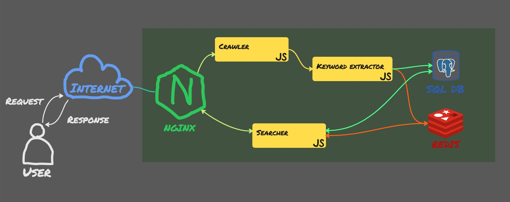

# Web crawler
Crawls requested web-sites and add them into database. Service extracts keywords from pages and associates them with these pages in the DB. Users can search for certain web-pages by keywords.
## Project structure
